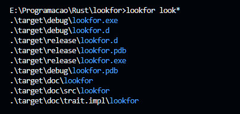

# lookfor



A cross-platform CLI tool to find and highlight files or folders that match a pattern.

## Features

- Cross-platform
- Case-sensitive and insensitive search (insensitive by default)
- Customizable colored output for highlighting (can be disabled by setting a `NO_COLOR` environment variable to any value or using the `-c off` flag)
- Glob pattern matching, e.g. `*.txt`
- Multithreaded search

## MSRV

| Version | Edition | MSRV |
| ------- | ------- | ---- |
| 1.3.y-3.x.y | 2024 | 1.85 |
| 1.0.y-1.2.y | 2021 | N/A |

## Installation

- From [crates.io](https://crates.io/crates/lookfor): `cargo install lookfor --features cli`
- From [GitHub](https://github.com/DarkCeptor44/lookfor): `cargo install --git https://github.com/DarkCeptor44/lookfor --features cli`
- From [releases](https://github.com/DarkCeptor44/lookfor/releases/latest).
- Manually:

```bash
git clone https://github.com/DarkCeptor44/lookfor
cd lookfor
cargo install --path . --features cli
```

## Usage

```bash
$ lookfor -h
Cross-Platform file finder

Usage: lookfor [OPTIONS] <PATTERN>

Arguments:
  <PATTERN>  Pattern to search for

Options:
      --in <PATH>          Path to search in [default: .]
  -c, --color <COLOR>      Color of the highlighted text (off or set NO_COLOR env var to disable) [default: blue]
  -I, --case-sensitive     Case sensitive search
  -t, --threads <THREADS>  Number of threads to use (0 for auto) [default: 12]
  -h, --help               Print help
  -V, --version            Print version
```

```bash
$ lookfor look* 
.\target\debug\lookfor.exe
.\target\debug\lookfor.d
.\target\release\lookfor.d
.\target\release\lookfor.pdb
.\target\release\lookfor.exe
.\target\debug\lookfor.pdb
.\target\doc\lookfor
.\target\doc\src\lookfor
.\target\doc\trait.impl\lookfor
```

## Tests

```bash
cargo test
```

## Benchmarks

```text
Timer precision: 100 ns
search                                   fastest       │ slowest       │ median        │ mean          │ samples │ iters        
├─ search_dir (1000 files, glob)         696.5 µs      │ 1.885 ms      │ 840.9 µs      │ 914 µs        │ 100     │ 100
│                                        1.435 Mitem/s │ 530.3 Kitem/s │ 1.189 Mitem/s │ 1.094 Mitem/s │         │
│                                        max alloc:    │               │               │               │         │
│                                          4           │ 4             │ 4             │ 4             │         │
│                                          289 B       │ 289 B         │ 289 B         │ 302.4 B       │         │
│                                        alloc:        │               │               │               │         │
│                                          5           │ 5             │ 5             │ 5.01          │         │
│                                          258 B       │ 258 B         │ 258 B         │ 273.2 B       │         │
│                                        dealloc:      │               │               │               │         │
│                                          3           │ 3             │ 3             │ 3             │         │
│                                          210 B       │ 210 B         │ 210 B         │ 210 B         │         │
│                                        grow:         │               │               │               │         │
│                                          1           │ 1             │ 1             │ 1             │         │
│                                          47 B        │ 47 B          │ 47 B          │ 47 B          │         │
├─ search_dir (1000 files, insensitive)  666.6 µs      │ 2.764 ms      │ 831.9 µs      │ 957.7 µs      │ 100     │ 100
│                                        1.499 Mitem/s │ 361.7 Kitem/s │ 1.201 Mitem/s │ 1.044 Mitem/s │         │
│                                        max alloc:    │               │               │               │         │
│                                          4           │ 4             │ 4             │ 4             │         │
│                                          289 B       │ 289 B         │ 289 B         │ 315.8 B       │         │
│                                        alloc:        │               │               │               │         │
│                                          5           │ 5             │ 5             │ 5.02          │         │
│                                          258 B       │ 258 B         │ 258 B         │ 288.4 B       │         │
│                                        dealloc:      │               │               │               │         │
│                                          3           │ 3             │ 3             │ 3             │         │
│                                          210 B       │ 210 B         │ 210 B         │ 210 B         │         │
│                                        grow:         │               │               │               │         │
│                                          1           │ 1             │ 1             │ 1             │         │
│                                          47 B        │ 47 B          │ 47 B          │ 47 B          │         │
╰─ search_dir (1000 files, sensitive)    671.3 µs      │ 2.557 ms      │ 828.6 µs      │ 926.7 µs      │ 100     │ 100
                                         1.489 Mitem/s │ 390.9 Kitem/s │ 1.206 Mitem/s │ 1.079 Mitem/s │         │
                                         max alloc:    │               │               │               │         │
                                           4           │ 4             │ 4             │ 4             │         │
                                           289 B       │ 289 B         │ 289 B         │ 302.4 B       │         │
                                         alloc:        │               │               │               │         │
                                           5           │ 5             │ 5             │ 5.01          │         │
                                           258 B       │ 258 B         │ 258 B         │ 273.2 B       │         │
                                         dealloc:      │               │               │               │         │
                                           3           │ 3             │ 3             │ 3             │         │
                                           210 B       │ 210 B         │ 210 B         │ 210 B         │         │
                                         grow:         │               │               │               │         │
                                           1           │ 1             │ 1             │ 1             │         │
                                           47 B        │ 47 B          │ 47 B          │ 47 B          │         │
```

The CLI benchmarks were performed using [Hyperfine](https://github.com/sharkdp/hyperfine).

- **Windows:** AMD64, 32GB RAM, Ryzen 7 3800X, Windows 11

| Command | Mean [ms] | Min [ms] | Max [ms] | Relative |
|:---|---:|---:|---:|---:|
| `dir /s /b *clap*` | 56.9 ± 2.0 | 54.3 | 66.9 | 1.24 ± 0.18 |
| `findstr /s /m /c:clap *` | 538.1 ± 18.3 | 525.7 | 577.7 | 11.76 ± 1.69 |
| `target\release\lookfor.exe clap` | 45.8 ± 6.4 | 39.2 | 72.1 | 1.00 |

### Linux

- ARM64, 1GB RAM, Orange Pi Zero2, Debian 12.

| Command | Mean [ms] | Min [ms] | Max [ms] | Relative |
|:---|---:|---:|---:|---:|
| `find . -iname "*clap*"` | 20.5 ± 0.3 | 19.7 | 21.5 | 1.00 |
| `target/release/lookfor clap` | 73.3 ± 1.3 | 70.6 | 76.5 | 3.57 ± 0.09 |

## License

This project is licensed under the terms of the [GNU General Public License](LICENSE) version 3.
