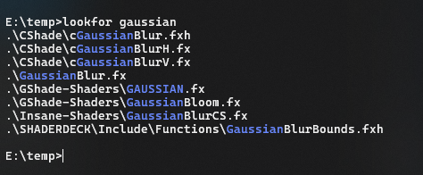

# lookfor

A cross-platform command line utility to find and highlight files that match a pattern.

## Installation

- From [crates.io](https://crates.io/crates/lookfor): `cargo install lookfor`
- From [GitHub](https://github.com/DarkCeptor44/lookfor): `cargo install --git https://github.com/DarkCeptor44/lookfor`
- Manually (after cloning the repo locally): `cargo install --path .`
- From [releases](https://github.com/DarkCeptor44/lookfor/releases/latest).

## Usage



```sh
$ lookfor -h
Cross-Platform file finder

Usage: lookfor [OPTIONS] <PATTERN>

Arguments:
  <PATTERN>  Pattern to search for

Options:
      --in <PATH>       Path to search in [default: .]
      --color <COLOR>   Color of the highlighted text (off for no color) [default: blue]
  -I, --case-sensitive  Case sensitive search
  -h, --help            Print help
  -V, --version         Print version
```

## Todo

- Add support for regular expressions.

## Benchmarks

The benchmarks were performed on different machines at the root of the repository after running both `cargo build` and `cargo build -r`, to find anything with `clap` in the target directory.

- Machine A: `AMD64, 32GB RAM, Ryzen 7 3800X`
- Machine B: `ARM64, 1GB RAM, Orange Pi Zero2`

### Windows

Ran on Machine A (Windows 10):

| Command | Mean [ms] | Min [ms] | Max [ms] | Relative |
|:---|---:|---:|---:|---:|
| `lookfor clap` | 81.4 ± 1.0 | 80.2 | 84.8 | 1.00 |
| `dir /s /b *clap*` | 98.8 ± 1.3 | 96.2 | 100.9 | 1.21 ± 0.02 |
| `findstr /s /m /c:clap *` | 1096.1 ± 7.0 | 1090.4 | 1115.1 | 13.46 ± 0.19 |

### Linux

Ran on Machine A (WSL2 Debian 12):

| Command | Mean [ms] | Min [ms] | Max [ms] | Relative |
|:---|---:|---:|---:|---:|
| `lookfor clap` | 167.4 ± 7.7 | 160.6 | 187.3 | 1.00 |
| `find . -iname "*clap*"` | 271.9 ± 13.3 | 250.0 | 283.1 | 1.62 ± 0.11 |

Ran on Machine B (Debian 12):

| Command | Mean [ms] | Min [ms] | Max [ms] | Relative |
|:---|---:|---:|---:|---:|
| `lookfor clap` | 24.1 ± 0.3 | 23.5 | 24.9 | 1.17 ± 0.03 |
| `find . -iname "*clap*"` | 20.6 ± 0.4 | 19.9 | 22.0 | 1.00 |

## License

This project is licensed under the terms of the [GNU General Public License](LICENSE) v3.0.
